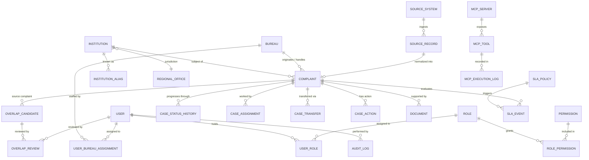

# AICTE NEXUS - ENTITY RELATIONSHIP (ER) DIAGRAM

```mermaid
erDiagram
    INSTITUTION ||--o{ COMPLAINT : "subject of"
    INSTITUTION ||--o{ INSTITUTION_ALIAS : "known as"
    INSTITUTION }o--|| REGIONAL_OFFICE : "jurisdiction"
    
    BUREAU ||--o{ COMPLAINT : "originates / handles"
    BUREAU ||--o{ USER_BUREAU_ASSIGNMENT : "staffed by"
    
    USER ||--o{ USER_BUREAU_ASSIGNMENT : "assigned to"
    USER ||--o{ USER_ROLE : "holds"
    ROLE ||--o{ USER_ROLE : "assigned to"
    ROLE ||--o{ ROLE_PERMISSION : "grants"
    PERMISSION ||--o{ ROLE_PERMISSION : "included in"
    
    COMPLAINT ||--o{ CASE_STATUS_HISTORY : "progresses through"
    COMPLAINT ||--o{ CASE_ASSIGNMENT : "worked by"
    COMPLAINT ||--o{ CASE_TRANSFER : "transferred via"
    COMPLAINT ||--o{ CASE_ACTION : "has action"
    COMPLAINT ||--o{ DOCUMENT : "supported by"
    COMPLAINT ||--o{ OVERLAP_CANDIDATE : "source complaint"
    
    OVERLAP_CANDIDATE ||--o{ OVERLAP_REVIEW : "reviewed by"
    USER ||--o{ OVERLAP_REVIEW : "reviewed by"
    
    SOURCE_SYSTEM ||--o{ SOURCE_RECORD : "ingests"
    SOURCE_RECORD ||--o| COMPLAINT : "normalized into"
    
    SLA_POLICY ||--o{ SLA_EVENT : "triggers"
    COMPLAINT ||--o{ SLA_EVENT : "evaluates"
    
    MCP_SERVER ||--o{ MCP_TOOL : "exposes"
    MCP_TOOL ||--o{ MCP_EXECUTION_LOG : "recorded in"
    
    USER ||--o{ AUDIT_LOG : "performed by"
```
